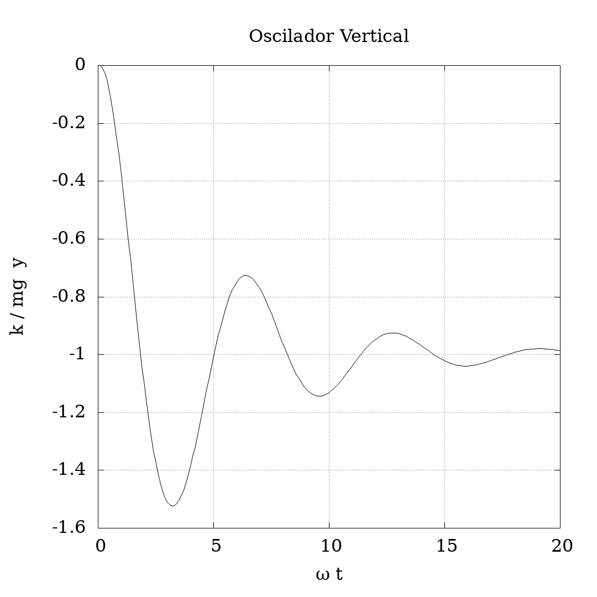
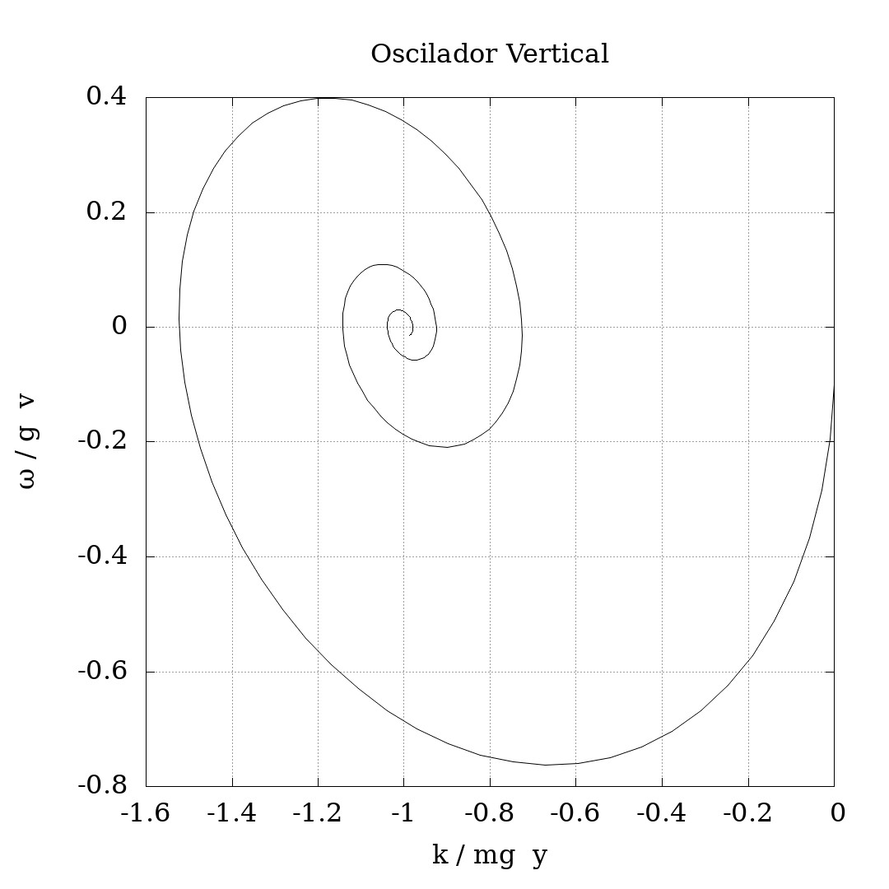

# Exemplo: Oscilador Harmônico Vertical

Neste exemplo o cabeçalho `pvi.h` é usado para obter uma solução numérica
para o oscilador harmônico vertical sujeito à ação de uma força de arrasto.

## Modelo

Pode-se postular que são três as forças que atuam sobre um corpo
suspenso no ar, preso ao teto por uma mola: 1)
a força execida pelo mola sobre o corpo, dada por
$- k y(t)$, onde $k$ é uma constante real positiva e, no instante $t$,
$|y(t)|$ é a distância do corpo à posição na qual a mola ficaria em equilíbrio,
com $y(t) > 0$ somente quando está acima do nível no qual fica em equilíbrio; 2)
a força da gravidade local, dada por $- m g$, onde $m$ é a massa do corpo
e $g$ é a aceleração local da gravidade; e 3)
a força de resistência ao movimento que o corpo sente por estar imerso no ar,
dada por $- \beta \dot{y}(t)$, onde $\beta$ é uma constante real positiva
e $\dot{y}(t)$ é a velocidade instantânea do corpo no instante $t$.
Pela segunda lei de Newton a seguinte equação diferencial deve ser satisfeita:

$$
   m \, \ddot{y}(t) = - k \, y(t) - \beta \, \dot{y}(t) - m g,
$$

onde $\ddot{y}(t)$ é a aceleração do corpo no instante $t$.

## Metodologia

A fim de poder utilizar o cabeçalho `pvi.h` é necessário reescrever
a equação diferencial como um sistema de equações equivalente onde somente
aparecem derivadas de primeira ordem.
Além disso, como é computacionalmente interessante,
também é conveniente que nesse novo sistema a "posição" e o "tempo"
sejam grandezas sem dimensão.

Note que $\sqrt{\frac{k}{m}}$ possui dimensão de inverso de tempo e portanto
$\tau = \omega t$ é adimensional.
Note também que $\frac{k}{m g}$ possui dimensão de inverso de metro
e portanto $x_{0}(\tau) = \frac{k}{m g} y(\omega^{-1} \, \tau)$
é adimensional.
Agora defina $x_{1}(\tau) = \frac{d}{d\tau} x_{0}(\tau)$ e também
$\gamma = \frac{\beta \omega}{k}$, então teremos o seguinte
sistema de equações diferenciais:

$$
   \left\{
   \begin{aligned}
      \frac{d}{d\tau} x_{0}(\tau) &= x_{1}(\tau) \\
      \frac{d}{d\tau} x_{1}(\tau) &= - x_{0}(\tau) - \gamma x_{1}(\tau) - 1
   \end{aligned}
   \right.
$$

É importante notar que o parâmetro $\gamma$ é o único parâmetro
relevante para o comportamento das soluções da equação diferencial,
como é fácil perceber olhando para o sistema de equações em vez de olhar
para a equação original.
A partir da solução para o sistema é fácil obter a solução para a equação
original, basta calcular $y(t) = \frac{m g}{k} x_{0}(\omega t)$.

Nesse problema a dimensão do espaço de estados é 2
e por isso `PVI_DIMENSIO` é definido como `2`.
Uma variável `memoria` será utilizada para toda as variáveis

```sh
clang -std=c23 -flto -O3 src/main.c -o main -lm
time ./main
gnuplot src/plot.gp
```

Ou, tudo de uma vez,

```sh
clang -std=c23 -flto -O3 src/main.c -o main -lm && time ./main && gnuplot src/plot.gp
```

Para remover os arquivos gerados pode-se usar o seguinte comando:

```sh
rm main dados.dat figura_*.png
```

## Resultados

Lorem ipsum

<p align="center">
  
</p>

Lorem ipsum

<p align="center">
  
</p>